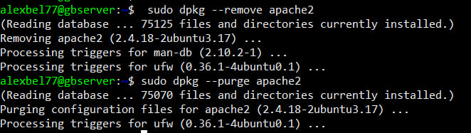

# Итоговая контрольная работа по блоку специализация

**1. Используя команду cat в терминале операционной системы Linux, создать два файла Домашние животные (заполнив файл собаками, кошками, хомяками) и Вьючные животными заполнив файл Лошадьми, верблюдами и ослы), а затем объединить их. Просмотреть содержимое созданного файла. Переименовать файл, дав ему новое имя (Друзья человека).**

**2. Создать директорию, переместить файл туда.**

 

**3. Подключить дополнительный репозиторий MySQL. Установить любой пакет из этого репозитория.**

 

 

 

 

**4. Установить и удалить deb-пакет с помощью dpkg.**

 

 

 

**6. Нарисовать диаграмму, в которой есть класс родительский класс, домашние животные и вьючные животные, в составы которых в случае домашних животных войдут классы: собаки, кошки, хомяки, а в класс вьючные животные войдут: Лошади, верблюды и ослы).**

 

***Задания `7 - 12` в файле `human_friends.sql`***

**14. Написать программу, имитирующую работу реестра домашних животных.**

Взаимодействие методов в приложении "Реестр домашних животных" происходит следующим образом:

**Метод `main` в классе `Application`:**

Метод main инициирует запуск приложения.
Устанавливается соединение с базой данных.
Создается экземпляр класса `AnimalRegistry` и вызывается его метод `start()` для отображения основного меню.

**Метод `start` в классе `AnimalRegistry`:**

Отображает основное меню с доступными операциями.
Ожидает ввода пользователя.
В зависимости от выбора пользователя вызывает соответствующий метод:

1. Добавление нового животного `(addNewAnimal())`.
2. Определение класса животного `(defineAnimalClass())`.
3. Просмотр списка команд `(showAnimalCommands())`.
4. Обучение новым командам `(teachAnimalCommands())`.
5. Выход из приложения.

**Методы для работы с базой данных:**

В каждом методе, работающем с базой данных, создается соединение с базой данных и выполняются соответствующие SQL-запросы. Результаты запросов обрабатываются и выводятся пользователю.

**Методы для работы с счетчиком:**

Метод `add()` класса `Counter` используется для увеличения счетчика при заведении нового животного. Он вызывается после успешного завершения метода `addNewAnimal()`. При завершении работы счетчика вызывается метод `close()`, который выполняет закрытие ресурсов.

